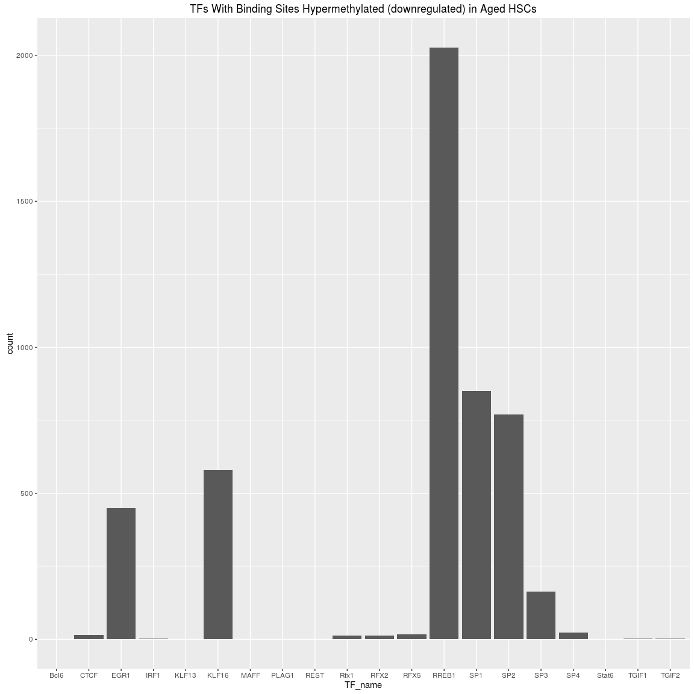

# Analysis of Predicted TF Binding Sites in DMRs in HSCs in Aged vs Young Mice
Kieran O'Neill and Shreejoy Tripathy  
19/07/2016  


# Introduction

Sun et al showed in [this paper](http://www.cell.com/cell-stem-cell/abstract/S1934-5909(14)00096-4) that hematopoeitic stem cells isolated from older (2 years) BL6 mice showed distinct methylation patterns from the same cell type isolated from young (3 month) mice. We characterised the predicted transcription factor binding sites within the differentially methylated regions from that study.

# Methods

## Data and FIMO

We took differentially methylated regions from the supplementary material from that paper. We split the DMRs into hypo- and hyper-methylated sets, then ran FIMO across each to predict which binding sites appeared. 

## Analysis

We filtered out calls with Q-value below 0.05.


# Results


## TFs Predicted within DMRs and Expressed in Cells 
<!-- --><!-- -->

## TFs Unique to Hyper/Hypo

TFs present in hypermethylated regions in the old mice but not in hypomethylated included PLAG1, RFX5, RFX2, KLF13, SP4, KLF16, SP3, TGIF1, TGIF2


TFs present in hypomethylated regions in the old mice but not in hypermethylated included Nfe2l2, FOXP1


## Gene Annotation


```
## >> preparing features information...		 2016-10-17 03:11:12 PM 
## >> identifying nearest features...		 2016-10-17 03:11:14 PM 
## >> calculating distance from peak to TSS...	 2016-10-17 03:11:14 PM 
## >> assigning genomic annotation...		 2016-10-17 03:11:14 PM 
## >> assigning chromosome lengths			 2016-10-17 03:11:24 PM 
## >> done...					 2016-10-17 03:11:24 PM
```

```
## >> preparing features information...		 2016-10-17 03:11:24 PM 
## >> identifying nearest features...		 2016-10-17 03:11:24 PM 
## >> calculating distance from peak to TSS...	 2016-10-17 03:11:25 PM 
## >> assigning genomic annotation...		 2016-10-17 03:11:25 PM 
## >> assigning chromosome lengths			 2016-10-17 03:11:26 PM 
## >> done...					 2016-10-17 03:11:26 PM
```

<!-- --><!-- -->


#Session Info


```
## R version 3.3.1 (2016-06-21)
## Platform: x86_64-pc-linux-gnu (64-bit)
## Running under: Ubuntu 16.04.1 LTS
## 
## locale:
##  [1] LC_CTYPE=en_CA.UTF-8       LC_NUMERIC=C              
##  [3] LC_TIME=en_CA.UTF-8        LC_COLLATE=en_CA.UTF-8    
##  [5] LC_MONETARY=en_CA.UTF-8    LC_MESSAGES=en_CA.UTF-8   
##  [7] LC_PAPER=en_CA.UTF-8       LC_NAME=C                 
##  [9] LC_ADDRESS=C               LC_TELEPHONE=C            
## [11] LC_MEASUREMENT=en_CA.UTF-8 LC_IDENTIFICATION=C       
## 
## attached base packages:
##  [1] grid      stats4    parallel  stats     graphics  grDevices utils    
##  [8] datasets  methods   base     
## 
## other attached packages:
##  [1] org.Hs.eg.db_3.3.0                      
##  [2] ChIPpeakAnno_3.6.5                      
##  [3] VennDiagram_1.6.17                      
##  [4] futile.logger_1.4.3                     
##  [5] Biostrings_2.40.2                       
##  [6] XVector_0.12.1                          
##  [7] dplyr_0.5.0                             
##  [8] TxDb.Mmusculus.UCSC.mm10.knownGene_3.2.2
##  [9] GenomicFeatures_1.24.5                  
## [10] org.Mm.eg.db_3.3.0                      
## [11] AnnotationDbi_1.34.4                    
## [12] Biobase_2.32.0                          
## [13] rtracklayer_1.32.2                      
## [14] GenomicRanges_1.24.3                    
## [15] GenomeInfoDb_1.8.7                      
## [16] IRanges_2.6.1                           
## [17] S4Vectors_0.10.3                        
## [18] BiocGenerics_0.18.0                     
## [19] ChIPseeker_1.8.9                        
## [20] ggplot2_2.1.0                           
## 
## loaded via a namespace (and not attached):
##  [1] matrixStats_0.51.0                     
##  [2] bitops_1.0-6                           
##  [3] RColorBrewer_1.1-2                     
##  [4] httr_1.2.1                             
##  [5] UpSetR_1.2.4                           
##  [6] tools_3.3.1                            
##  [7] R6_2.1.3                               
##  [8] KernSmooth_2.23-15                     
##  [9] DBI_0.4-1                              
## [10] colorspace_1.2-6                       
## [11] ade4_1.7-4                             
## [12] gridExtra_2.2.1                        
## [13] graph_1.50.0                           
## [14] formatR_1.4                            
## [15] labeling_0.3                           
## [16] caTools_1.17.1                         
## [17] scales_0.4.0                           
## [18] RBGL_1.48.1                            
## [19] stringr_1.0.0                          
## [20] digest_0.6.9                           
## [21] Rsamtools_1.24.0                       
## [22] rmarkdown_1.1                          
## [23] DOSE_2.10.7                            
## [24] htmltools_0.3.5                        
## [25] plotrix_3.6-3                          
## [26] ensembldb_1.4.7                        
## [27] limma_3.28.21                          
## [28] BSgenome_1.40.1                        
## [29] regioneR_1.4.2                         
## [30] RSQLite_1.0.0                          
## [31] BiocInstaller_1.22.3                   
## [32] shiny_0.14.1                           
## [33] TxDb.Hsapiens.UCSC.hg19.knownGene_3.2.2
## [34] BiocParallel_1.6.3                     
## [35] gtools_3.5.0                           
## [36] GOSemSim_1.30.3                        
## [37] RCurl_1.95-4.8                         
## [38] magrittr_1.5                           
## [39] GO.db_3.3.0                            
## [40] Matrix_1.2-6                           
## [41] Rcpp_0.12.6                            
## [42] munsell_0.4.3                          
## [43] stringi_1.1.1                          
## [44] yaml_2.1.13                            
## [45] MASS_7.3-45                            
## [46] SummarizedExperiment_1.2.3             
## [47] zlibbioc_1.18.0                        
## [48] gplots_3.0.1                           
## [49] plyr_1.8.4                             
## [50] qvalue_2.4.2                           
## [51] AnnotationHub_2.4.2                    
## [52] gdata_2.17.0                           
## [53] DO.db_2.9                              
## [54] lattice_0.20-33                        
## [55] splines_3.3.1                          
## [56] multtest_2.28.0                        
## [57] knitr_1.14                             
## [58] igraph_1.0.1                           
## [59] boot_1.3-17                            
## [60] seqinr_3.3-3                           
## [61] codetools_0.2-14                       
## [62] reshape2_1.4.1                         
## [63] biomaRt_2.28.0                         
## [64] futile.options_1.0.0                   
## [65] XML_3.98-1.4                           
## [66] evaluate_0.9                           
## [67] lambda.r_1.1.9                         
## [68] idr_1.2                                
## [69] httpuv_1.3.3                           
## [70] gtable_0.2.0                           
## [71] assertthat_0.1                         
## [72] gridBase_0.4-7                         
## [73] mime_0.5                               
## [74] xtable_1.8-2                           
## [75] survival_2.39-4                        
## [76] tibble_1.2                             
## [77] GenomicAlignments_1.8.4                
## [78] memoise_1.0.0                          
## [79] interactiveDisplayBase_1.10.3
```
